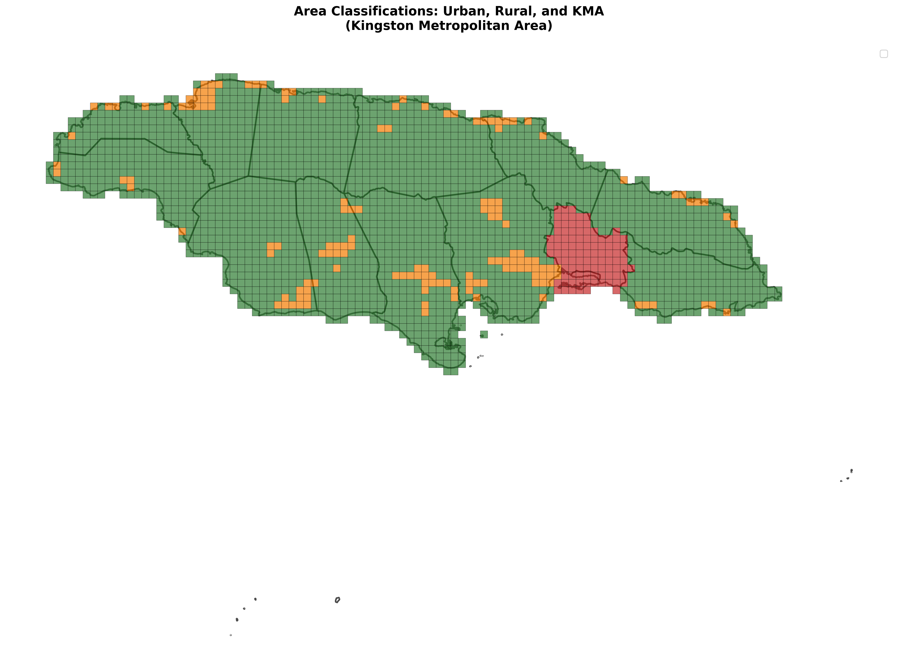

# Poor Population Impact Analysis

Geospatial disaggregation of poverty rates using Relative Wealth Index (RWI) to identify locations of poor children and assess hurricane impact in Jamaica.

## Overview

This project analyzes the spatial distribution of poor children (ages 0-15) in Jamaica by disaggregating official poverty rates into high-resolution geospatial data. It uses Relative Wealth Index (RWI) data to model the relationship between wealth and poverty, enabling evidence-based decision-making for disaster impact assessment and resource allocation.

## Key Features

- **Multiple Methodologies**: Compares binary ranking, sigmoid functions, and interpolation methods (PCHIP, Akima)
- **Spatial Analysis**: Disaggregates parish-level poverty rates to tile-level (level 14 Mercator tiles)
- **Impact Assessment**: Calculates expected impacted poor children using hurricane impact probabilities
- **Area Classification**: Classifies regions as Rural, Urban, or KMA (Kingston Metropolitan Area)
- **Comprehensive Visualizations**: Generates maps, charts, and summary tables

## Methodology

### Area Classification
- **KMA**: Kingston + Saint Andrew parishes (highest priority)
- **Urban**: SMOD ≥ 20 (excluding KMA)
- **Rural**: SMOD < 20 (excluding KMA)



### Poverty Modeling Approaches

1. **Binary Ranking**: Selects poorest tiles by RWI until target poor children count is reached
2. **Sigmoid Function**: Uses logistic curve to model poverty probability as a function of RWI
3. **Interpolation Methods**: Fits PCHIP or Akima interpolation to quintile points with boundary conditions

All methods are calibrated to match official poverty statistics while providing nuanced spatial distribution.


## Data Requirements

- Administrative boundaries (parish-level)
- Tile-level data with RWI, population, and children population
- Hurricane impact probability data (optional)
- Poverty rates by area classification (Rural, Urban, KMA)

## Installation

```bash
pip install -r requirements.txt
```

## Usage

1. **Configure paths and parameters** in the notebook configuration cells
2. **Run notebooks** in order (note dependencies):
   - `poor_children_impact_analysis.ipynb` - Binary ranking method (standalone)
   - `poor_children_quintile_method.ipynb` - Quintile-based approach (standalone, required for step 4)
   - `poor_children_impact_analysis_slope_optimization.ipynb` - Sigmoid optimization (standalone, required for step 4)
   - `poor_children_impact_analysis_sig_opt_and_interpolation.ipynb` - Method comparison (**requires outputs from steps 2 & 3**)

3. **View results** in `analysis_output/` directory

### Notebook Dependencies

- `poor_children_impact_analysis_sig_opt_and_interpolation.ipynb` requires:
  - Output from `poor_children_quintile_method.ipynb`: quintile points (RWI averages and poverty rates per quintile)
  - Output from `poor_children_impact_analysis_slope_optimization.ipynb`: pre-processed tiles with spatial joins and area classifications (note: the slope optimization results themselves are not used, only the pre-processed spatial data)

## Key Outputs

- **Geospatial Data**: GeoJSON and Parquet files with tile-level poverty probabilities
- **Summary Tables**: CSV files with parish-level impact analysis
- **Visualizations**: Maps, charts, and formatted tables (PNG)

